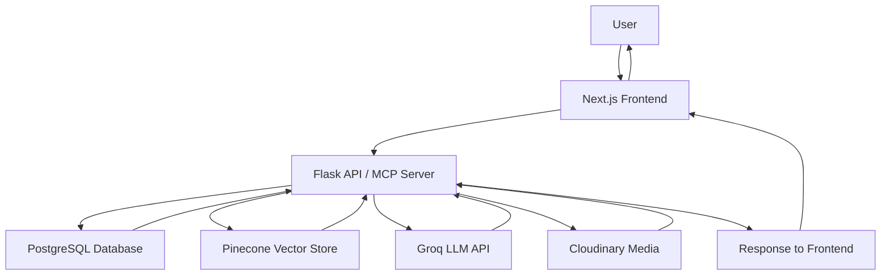

# Zuntra: AI-Powered Real Estate Platform

AI-driven property discovery and roommate matching platform specializing in PG accommodations with semantic search capabilities and multilingual support.

## Badges


## Screenshots


## Features

✅ User Registration (mobile-based)  
✅ Property Management (PG listings)  
✅ Semantic Property Search (natural language queries)  
✅ AI Assistant with 10 specialized modes  
✅ Visit Booking System  
✅ Owner Messaging  
✅ Roommate Matching (compatibility scoring)  
✅ Advertisement Generation (AI‑generated property ads)  
✅ Move‑in Assistance (personalized checklists)  
✅ Subscription Management (placeholder)  
✅ Property Favorites / Likes  
✅ Multilingual Support (English, Hindi, Tamil, Telugu, Kannada)  
✅ Cloudinary Media Storage  
✅ RESTful API & MCP (Model Context Protocol) endpoints  

*Note: Voice replies (text‑to‑speech) are available in the legacy `app.py` Flask app but are not wired into the main `combined.py` backend.*

## Architecture



## AI Pipeline

```mermaid
flowchart TD
    A[User Query] --> B[Language Detection]
    B --> C[Intent Detection (10 assistants)]
    C --> D[Database Retrieval (UserPreference, Visits, Likes, etc.)]
    D --> E[Query Enhancement (property search only)]
    E --> F[Embedding Generation (sentence‑transformers/all-MiniLM-L6-v2)]
    F --> G[Pinecone Vector Search (top‑k=5)]
    G --> H[Context Building (DB + Vector results)]
    H --> I[Prompt Construction (system rules + retrieved context)]
    I --> J[LLaMa 3.1 8B (Groq)]
    J --> K[Response (constrained to detected language)]
    K --> L[JSON Reply]
```

## Tech Stack

| Layer          | Technology                                 |
|----------------|--------------------------------------------|
| Frontend       | Next.js 13 (App Router), React, TailwindCSS, Zustand, TanStack Query |
| Backend        | Python 3.10, Flask, FastMCP (MCP server)   |
| Database       | PostgreSQL (via psycopg2 / raw SQL)        |
| ORM / Schema   | Prisma (schema.prisma) – used by optional NestJS service |
| AI / LLM       | Groq API (LLaMA 3.1 8B)                    |
| Embedding      | SentenceTransformer (`all-MiniLM-L6-v2`)   |
| Vector DB      | Pinecone (index: `realestate`)             |
| Cloud Storage  | Cloudinary (images, audio)                 |
| Voice (legacy) | gTTS, ElevenLabs (API keys present)        |
| Dev Tools      | Git, npm, pip, virtualenv, Prettier, ESLint |

## Folder Structure

```
Zuntra-Day4/
├── frontend/                 # Next.js 13 app (App Router)
│   ├── app/                  # Route components
│   │   ├── assistant/        # AI chat interface
│   │   ├── dashboard/        # User dashboard
│   │   ├── properties/       # Property browse & search
│   │   └── roommates/        # Roommate matching
│   ├── components/           # Reusable UI blocks
│   ├── lib/                  # API clients, utilities, types, stores
│   └── styles/               # Global CSS, Tailwind config
├── src/                      # (Optional) NestJS/TypeScript service
│   ├── apartment/
│   ├── messages/
│   ├── otp/
│   ├── pg-details/
│   ├── property-view/
│   ├── subscription/
│   ├── user/
│   ├── user-preference/
│   ├── visits/
│   ├── likes/
│   └── prisma/               # Prisma schema & client
├── combined.py               # Main Flask + MCP server (real embeddings)
├── app.py                    # Legacy Flask stub (placeholder embeddings)
├── prisma/
│   └── schema.prisma         # Database models
├── requirements.txt          # Python dependencies
├── package.json              # Node.js dependencies
├── .env                      # Environment variables (see template below)
└── README.md
```

## Installation

### Prerequisites
- Node.js ≥18
- Python ≥3.10
- PostgreSQL database
- Pinecone account
- Groq API key
- Cloudinary account

### Backend (Flask + MCP)

```bash
# Clone repository
git clone https://github.com/yourusername/zuntra.git
cd zuntra

# Python virtual environment
python -m venv venv
source venv/bin/activate   # Windows: venv\Scripts\activate

# Install dependencies
pip install -r requirements.txt

# Configure environment (see .env.example or .env)
cp .env.example .env   # then edit .env with your keys
# Required vars: DATABASE_URL, GROQ_API_KEY, PINECONE_API_KEY, PINECONE_INDEX,
#                CLOUDINARY_CLOUD_NAME, CLOUDINARY_API_KEY, CLOUDINARY_API_SECRET

# Start the server (Flask + MCP)
python combined.py
# Server runs on http://localhost:5000
```

### Frontend (Next.js)

```bash
cd frontend
npm install
# Create .env.local (copy .env.example if exists)
cp .env.example .env.local   # then edit
# Required: NEXT_PUBLIC_API_BASE_URL (e.g., http://localhost:5000)
npm run dev
# Frontend runs on http://localhost:3000
```

### Environment Variables

| Variable                       | Purpose                                                                   | Required |
|--------------------------------|---------------------------------------------------------------------------|----------|
| `DATABASE_URL`                 | PostgreSQL connection string                                              | Yes      |
| `GROQ_API_KEY`                 | API key for Groq (LLaMA 3.1)                                              | Yes      |
| `PINECONE_API_KEY`             | API key for Pinecone vector database                                      | Yes      |
| `PINECONE_INDEX`               | Name of Pinecone index (default: `realestate`)                            | Yes      |
| `CLOUDINARY_CLOUD_NAME`        | Cloudinary cloud name                                                     | Yes      |
| `CLOUDINARY_API_KEY`           | Cloudinary API key                                                        | Yes      |
| `CLOUDINARY_API_SECRET`        | Cloudinary API secret                                                     | Yes      |
| `PORT`                         | Port for Flask server (default: `5000`)                                   | No       |
| `FLASK_DEBUG`                  | Enable Flask debug mode (`true`/`false`)                                  | No       |
| `ZUNTRA_RUN_MODE`              | `flask` (default) or `mcp` – run as plain Flask or MCP‑only server        | No       |
| `NEXT_PUBLIC_API_BASE_URL`     | Base URL for backend API (used by frontend)                               | Yes (frontend) |

*Never commit real secrets. Use `.env.example` as a template.*

## API Overview

| Method | Endpoint                         | Description                                                                 |
|--------|----------------------------------|-----------------------------------------------------------------------------|
| `GET`  | `/health`                        | Health check                                                                |
| `POST` | `/register`                      | Register a new user (mobile, name, city)                                    |
| `POST` | `/add-property`                  | Add a new property (requires ownership info)                                |
| `GET`  | `/properties`                    | List properties with optional filters (city, locality, propertyType, limit) |
| `GET`  | `/properties/semantic`           | Semantic search via natural language query (and optional city filter)       |
| `POST` | `/like`                          | Like / save a property (userId, propertyId)                                 |
| `POST` | `/visit`                         | Book a property visit (userId, propertyId, visitDateTime)                   |
| `POST` | `/message`                       | Send a message to a property owner                                          |
| `POST` | `/roommate`                      | Save roommate preferences (userId, preferences JSON)                        |
| `GET`  | `/matches/:uid`                  | Get compatible roommates for a user (score ≥ 5)                             |
| `POST` | `/generate-ad`                   | Generate an advertisement for a property (propertyId, imagePath)            |
| `GET`  | `/move-in/:pid`                  | Get move‑in suggestions for a property                                      |
| `POST` | `/chat`                          | Main AI assistant endpoint (userId, message, optional city)                 |
| `POST` | `/voice-reply`                   | *(Legacy only – available in `app.py`)* Voice‑enabled AI reply              |

Detailed request/response schemas are available in `docs/API.md`.

## Database Overview

The data model consists of the following core entities (see `prisma/schema.prisma`):

- **User** – mobile‑based authentication, profile info  
- **Property** (`PGDetails`) – listings (city, locality, amenities, media, etc.) – *the only property type with active API endpoints*  
- **UserPreference** – saved search & roommate criteria  
- **Like** – user‑saved properties  
- **Visit** – booked property tours  
- **Message** – conversations between users and owners  
- **Subscription** – premium plans (stub)  
- **Otp** – verification (stub)  
- **Apartment**, `PropertyView`, etc. – additional property types defined in schema but without dedicated API routes in the current backend  

Relationships are defined via foreign keys (e.g., a Property belongs to a User; a Message links sender, receiver, and Property).

See `docs/Database.md` for the full ER diagram and field descriptions.

## Project Highlights

- **Hybrid Search**: Combines keyword‑based filtering with vector‑based semantic search using sentence‑transformers and Pinecone.  
- **Modular Assistant**: 10 distinct assistant personas (property search, visit booking, messaging, roommate matching, etc.) selected via keyword‑based intent detection.  
- **Privacy‑First Language Handling**: Detects user language (EN, HI, TA, TE, KN) and constrains the LLM to respond exclusively in that language.  
- **Model‑Context‑Protocol (MCP)**: Exposes capabilities as MCP tools enabling LLM‑agent interaction beyond REST.  
- **Cloud‑Native Media**: Stores and transforms property images via Cloudinary CDN.  
- **Full‑Stack TypeScript‑Python**: Next.js frontend with a Python‑Flask backend; optional NestJS service showcases Prisma/TypeScript alternative.  
- **Extensible Design**: Clear separation of concerns (routing, services, data access) facilitates adding new assistants or property types.

## Current Limitations

- **Voice replies** are only present in the legacy `app.py` (which uses a dummy embedding function returning zeros). The main `combined.py` backend does not expose `/voice-reply`.  
- **Authentication** relies solely on mobile‑number checking; no password‑based authentication, JWT, or session management.  
- **Payment integration** for subscriptions is a stub – no actual billing gateway.  
- **Property detail page**: The frontend currently lacks a dedicated `/properties/:id` route; details are shown via cards from the list view.  
- **No admin/dashboard** for property owners to manage listings beyond creation.  
- **Missing real‑time features** (e.g., WebSocket‑based chat updates, live notifications).  
- **Test coverage**: No unit or integration tests visible in the repository.  
- **Dockerization**: No `Dockerfile` or `docker-compose.yml` provided.  
- **CI/CD**: No GitHub Actions or similar workflows.  

## Future Improvements

- [ ] Replace mobile‑only auth with JWT‑based authentication (email/password + OAuth).  
- [ ] Add payment processor (Stripe/Razorpay) for subscription flows.  
- [ ] Implement property detail route (`/properties/:id`) and owner dashboard.  
- [ ] Add file upload endpoints for property images (direct to Cloudinary).  
- [ ] Introduce caching layer (Redis) for frequent queries.  
- [ ] Containerize the backend with Docker and provide `docker-compose.yml`.  
- [ ] Add unit/integration tests (Jest for frontend, pytest for backend).  
- [ ] Set up GitHub Actions for linting, testing, and deployment.  
- [ ] Implement rate limiting and input validation (e.g., via Pydantic or Joi).  
- [ ] Add WebSocket support for real‑time chat and notifications.  
- [ ] Expand multilingual support to additional Indian languages.  
- [ ] Provide admin UI for moderation and analytics.  

## Contributing

We welcome contributions! Please follow these steps:

1. Fork the repository.  
2. Create a feature branch (`git checkout -b feature/awesome-feature`).  
3. Make your changes, ensuring you follow the existing code style.  
4. Add or update tests as appropriate.  
5. Commit your changes (`git commit -am 'Add awesome feature'`).  
6. Push to the branch (`git push origin feature/awesome-feature`).  
7. Open a Pull Request against the `main` branch.  

Please ensure your pull request description clearly explains the problem and solution.

## License

This project is licensed under the MIT License – see the [LICENSE](LICENSE) file for details.

## Author

**Mohana Sriram G**  
Software Engineer | Full‑Stack Developer | AI Enthusiast  

GitHub: [https://github.com/gmohanasriram](https://github.com/gmohanasriram-wq)  
LinkedIn: [https://linkedin.com/in/gmohanasriram](http://linkedin.com/in/mohana-sriram-g-072062340)  
Email: gmohanasriram@gmail.com
