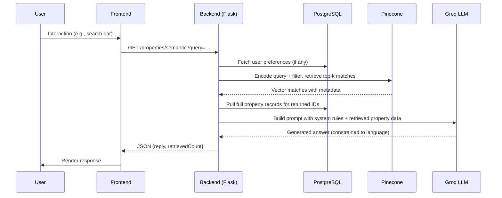

# Architecture Overview

Zuntra is a full‑stack real‑estate platform that combines a Next.js frontend with a Python‑Flask backend (optionally runnable as an MCP server). The system uses PostgreSQL for transactional data, Pinecone for vector similarity search, and Groq’s LLaMA‑3.1 8B model for language understanding and generation.

## High‑Level Components

```mermaid
graph TD
    A[End User] --> B[Next.js Frontend (React/Tailwind)]
    B --> C[REST API / MCP Endpoints (Flask)]
    C --> D[PostgreSQL (OLTP)]
    C --> E[Pinecone (Vector DB)]
    C --> F[Groq LLM API]
    C --> G[Cloudinary (Media Storage)]
    H[DevOps] -->|CI/CD| C
    H -->|Monitoring| C
```

### 1. Frontend (`/frontend`)
- **Framework**: Next.js 13 (App Router) with React 18.
- **Styling**: Tailwind CSS + Headless UI via custom components.
- **State Management**: Zustand stores (e.g., user store) and React Query for server state.
- **Features**:
  - User onboarding (calls `/register`).
  - Property search & listing (uses `/properties` and `/properties/semantic`).
  - Roommate matching (`/matches/:uid`).
  - AI chat assistant (`/chat`).
  - Dashboard with metrics and profile info.

### 2. Backend (`combined.py`)
- **Language**: Python 3.10.
- **Framework**: Flask (for HTTP) + FastMCP (for Model Context Protocol).
- **Core Responsibilities**:
  - **Request routing** – maps endpoints to handler functions.
  - **Business logic** – intent detection, context building, validation.
  - **Data access** – raw SQL via `psycopg2` (with `RealDictCursor`).
  - **External services**:
    - **PostgreSQL** – persistent storage for users, properties, visits, messages, preferences, etc.
    - **Pinecone** – vector index (`realestate`) storing property embeddings for semantic search.
    - **Groq** – LLaMA‑3.1‑8B inference for answer generation.
    - **Cloudinary** – image upload and transformation (used by `/generate-ad`).
    - **(Optional) gTTS / ElevenLabs** – text‑to‑speech in the legacy `app.py` only.
- **Modular Design**:
  - Each assistant type (property search, visit booking, etc.) is implemented as a branch in `build_context()` and a corresponding system prompt in `/chat`.
  - MCP tools expose the same capabilities as the HTTP API, enabling LLM agents to invoke them programmatically.

### 3. Data Layer (`prisma/`)
- Although the Flask app uses raw SQL, the repository includes a Prisma schema (`schema.prisma`) that defines the exact same tables. An optional NestJS service (`/src`) demonstrates how the same model can be consumed via an ORM.
- **Entities** (see `docs/Database.md`):
  - `User`, `Property` (PGDetails), `UserPreference`, `Like`, `Visit`, `Message`, `Subscription`, `Otp`, `Apartment`, `PropertyView`, `VisitStatus`.

### 4. Integration Flow (Typical Request)



### 5. Deployment Options

- **Standard Flask mode**: `python combined.py` → serves both REST API on `:5000`.
- **MCP‑only mode**: `ZUNTRA_RUN_MODE=mcp python combined.py` → runs as an MCP server (stdout/stdin or SSE) for LLM agent consumption.
- **Production**: Behind a reverse proxy (NGINX) with a WSGI server (Gunicorn/uWSGI); environment variables injected via the host platform (e.g., Render, Fly.io, Docker).

### 6. Security & Privacy

- All secrets (API keys, DB URL) are injected via environment variables; none are hard‑coded.
- Input validation is performed manually in each endpoint (required‑field checks). No generalized schema validation library is used.
- The LLM prompt explicitly forbids hallucination and instructs the model to use **only** the supplied context.
- Language detection ensures responses stay in the user‑detected language (English, Hindi, Tamil, Telugu, Kannada); however, no profanity filter or content moderation is present.

### 7. Extensibility

- Adding a new assistant type involves:
  1. Adding a keyword bucket to `detect_assistant_type()`.
  2. Extending `build_context()` with a new `elif` branch to fetch relevant data.
  3. Adding a clause to the system prompt in `/chat`.
- New property fields can be added to the PostgreSQL `Property` table and mirrored in the Pinecone metadata schema.
- The MCP server allows any LLM‑agent framework (e.g., LangChain, AutoGPT) to call capabilities without custom HTTP glue.

--- 
*End of document*